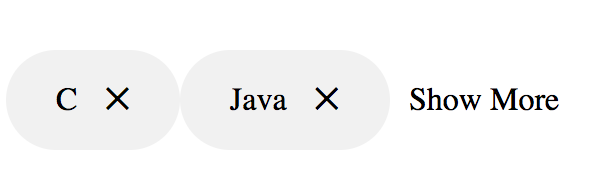
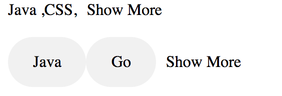

# React Read More Less

[](https://nodei.co/npm/react-read-less-more/)
[]

## Install
```
npm install react-read-less-more --save

```
## Usage
```js
import ReactReadLessMore from 'react-read-less-more';

class ReadMoreAndLessText extends Component {
    render() {
        return (
            <ReactReadLessMore lessText="Show Less" moreText="Show More" displayCount={2} >
            <span>Java ,</span>
            <span>SQL </span>
            <span>HTML</span>
            <span>JavaScript</span>
        </ReactReadLessMore>
        );
    }
}
```
## Usage
```js
import ReactReadLessMore from 'react-read-less-more';
const data1 = [{label:"C"},{label:"Java"},{label:"Go"},{label:"Javascript"},{label:"HTML"},{label:"CSS"},{label:"REACT"},{label:"JQUERY"}];

const data2 = ["C","Java","Go"];

class ReadMoreAndLessText extends Component {
    render() {
        return (
            <ReactReadLessMore lessText="less" moreText="more"  displayType="CHIP"  deleteChip={(data)=>{}}
            onClick={(data)=>{}}
        dataSeparator="" displayCount={2} displayKey="label" data={data}>
        </ReactReadLessMore>
        );
    }
}
```




## PROPTYPES
| Prop | Type | Default |
| ---- | ---- | ------- |
| clsName | String |  |
| charLimit | integer | 30 |
| moreText | String | Read more |
| lessText | String | Read less |
| displayType | String | for displaying as chip( displayType = "CHIP") |
| dataSeparator | String | to separate each data item (',' or ';') |
| data | Array | input data array to display.data can be array objects or array of string/number  |
| displayKey| String | attribute in the input data, example given above |
| dataItemClass | String | To customize the data item,pass your custom css class in dataItemClass |
| onClick | String | To add on click event on element, pass ypur method onClick prop,it will return the data item in input array|
| deleteChip | String | event will be added to cross icon,to enable add event on element  |
| deleteIcon | String | To customize the delete icon pass the css class name  |
| autoClose | String | To enable open only one at time , (In progress ) |


# react-read-less-more